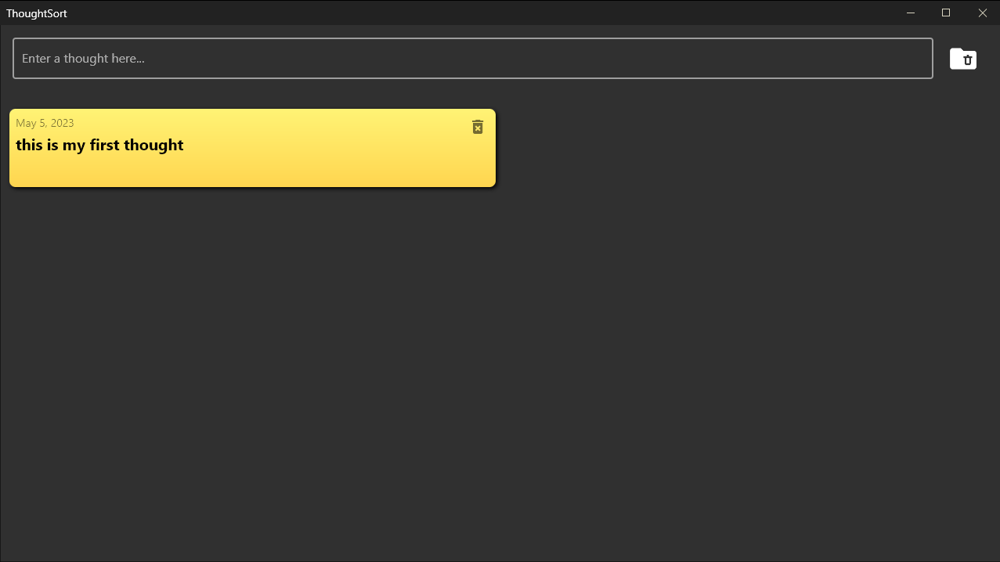
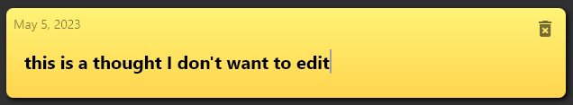

# ThoughtSort

## Contributors

- Isaac Jones
- William Kloppenberg
- Julien Marcuse (Redempt)
- Jacob Myers  
- Raymond Zheng

## Project
ThoughtSort is an application for recording your thoughts or taking notes. It has a simple, easy interface. It is extraordinarily responsive for creating, editing, and searching your thoughts. 

ThoughtSort was developed with in the Dart language using the Flutter framework for cross platform application development. ThoughtSort is exclusively developed for Windows.

### Features

- Easily creating/removing/editing thoughts.
- Search for previous thoughts by matching partial/whole words anywhere in the original thought.
- Thoughts are saved locally and time-stamped on creation.
- 'Clear Mind' button next to entry bar deletes all thoughts.

### Screenshots
Here we have an empty mind.

When I use the entry to create a new thought, this is what it looks like.

Thoughts are shown in reverse order in which they were created (newest at the top).

Colors are meant to distinguish each thought (they are preset gradients).

Clicking the trash can button on the thought will delete it, and not effect the color of the others, as it is based on their unique ID.

When I start entering in text to the entry bar, it will search through my existing thoughts using an efficient data structure to match partial/whole words in thoughts I have already made.

This way you can easily find older thoughts you made, and avoid duplicate them!

It can match as many partial/whole words as desired.

Here we have a thought I would like to edit.

Clicking on the card will enter a seamless text editor. Clicking off or pressing enter will save the changes.

